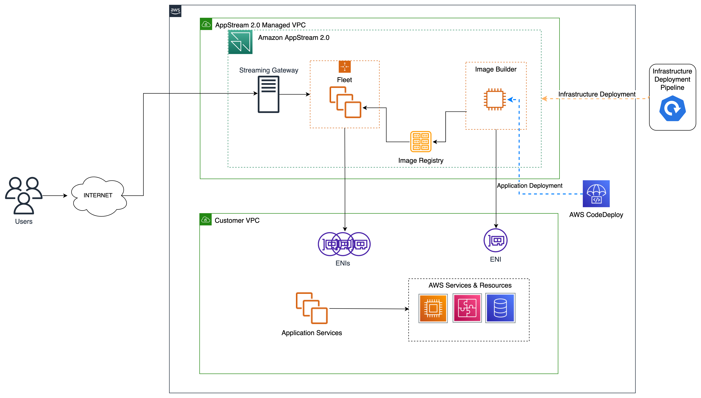

# Terraform for Amazon  AppStream 2.0 Deployment Pipeline

This repository contains the Terraform module that is provided as part of the AWS blog post [Automation of infrastructure and application deployment for Amazon  AppStream 2.0 with Terraform](). Please refer the blog article for prescriptive guidance on how to build a fully automated pipeline to provision Amazon  AppStream 2.0 infrastructure and deploy application components on the Amazon  AppStream 2.0 Image builder. 

## Amazon  AppStream 2.0 Resources
Amazon  AppStream 2.0 is a fully managed, secure application streaming service that allows streaming of desktop applications from AWS to a web browser.  AppStream 2.0 manages the AWS resources required to host and run applications, scales automatically, and provides access to users on demand. Below are some of the important components that make up the  AppStream 2.0 ecosystem.

### Image builder
An image builder is a virtual machine that is used to create an image. After an image builder instance is created, the application to be streamed should be installed, configured and tested on the image builder, and then use it to create an image. 

### Fleet
A fleet consists of fleet instances (also known as streaming instances) that run the application. 

### Stack
A stack consists of an associated fleet, user access policies, and storage configurations. A stack should be setup to start streaming applications to users.

### AWS Managed VPC
All of the  AppStream 2.0 related components would be deployed within an AWS Managed VPC which is transparent to the customer. The  AppStream 2.0 image builder and fleet instances integrate with other resources in the customer VPC via ENIs that are provisioned along with the corresponding  AppStream 2.0 components.
## Application resource connectivity
Connectivity between the  AppStream 2.0 resources and the resources in the application VPC is established through ENIs. As part of the provisioning,  AppStream 2.0 creates an ENI for each of the  AppStream 2.0 instances (Image builder & Fleet) in the application subnet. 


## Solution Architecture
Below is the architecture diagram describing the different Amazon  AppStream 2.0 components and their deployment.



The  AppStream 2.0 components will reside within an Amazon managed VPC while application specific resources will reside in the customer VPC. To interact with the application resources, as part of the  AppStream 2.0 resource provisioning, the customer VPC needs to be provided as one of the parameters. 

This solution assumes that you already use an Infrastructure-as-Code (IaC) deployment pipeline and a continious deployment (CD) pipeline for infrastucture and application deployments respectively. However, you could also customize this solution to suit your needs even if you do not have use dedicated pipelines for deployment.  

## Requirements
- An AWS Account must be available and the deployment machine must be able to deploy on this account. ([How to create an AWS account](https://aws.amazon.com/premiumsupport/knowledge-center/create-and-activate-aws-account/?nc1=h_ls) | [AWS Command Line Interface](https://aws.amazon.com/cli/))

- The user or role deploying the solution must have the following policies:
    - `PowerUserAccess`
    - `IAMFullAccess`
    
- [Hashicorp Terraform v.1.0.9+](https://www.terraform.io/) must be installed on the deployment machine to deploy the infrastructure ([Instructions](https://www.terraform.io/cli)).
- A customer VPC and one or more application subnets must be created
-  OPTIONAL: IaC deployment pipeline like [Terraform Enterprise](https://developer.hashicorp.com/terraform/enterprise) or similar for infrastructure provisioning and state management
- OPTIONAL: Continious Deployment (CD) pipeline like [AWS CodeDeploy](https://aws.amazon.com/codedeploy/) or similar for application deployment

## Deployment
### Deployment Orchestration
At a high-level, the steps to orchestrate the end-to-end deployment of the  AppStream 2.0 components in a repeatable fashion are,
1. Create a customized base image by applying the appropriate security patches and hardening scripts
2. Provision the baseline Amazon  AppStream 2.0 infrastructure, namely, the Image builder using the customized base image, Fleet instances running the base image, and the  AppStream 2.0 Stack using the Terraform modules in this repo from an IaC pipeline.
3. Deploy the application components on the Amazon  AppStream 2.0 Image builder using the CD pipeline
4. Configure the application and create an application image
5. Re-provision the Amazon  AppStream 2.0 fleet instances using the IaC pipeline with the newly created image to produce a fully functional stack
### Deployment Using IaC Pipeline

As mentioned in the preceeding section (and in more detail in the blog), as part of the end-to-end orchestration of an  AppStream 2.0 workload, you would first need to provision the baseline  AppStream 2.0 infrastructure, i.e. Step #2 in the blog. Later you would re-provision the  AppStream 2.0 fleet instances with the newly created image, i.e. Step #4 in the blog. The accompanying terraform module can be utilized to accomplish the above steps by configuring the terraform module 

1. Link this repository as the source code repository of your IaC pipeline
2. Update the following variables in `_variables.tf` file
    - `vpc_name` - Provide the name of the Customer VPC 
    - `app_subnet_name` - Provide the name of the application subnet
    - `image_builder_base_image_name` - Provide the value of the custom image builder that you created as part of Step #1 in the blog
3. Update the other default values in `_variables.tf` and `_locals.tf`as per your needs. 
4. Check-in your changes to the source code repository or directly update the variables in your IaC pipeline
5. Trigger the pipeline to provision all the resources

To reprovision the  AppStream 2.0 fleet i.e. Step #4 in the blog, do the following.
1. Set the value of the application image, created as per instructions in Step #3 of the blog, as the value of the variable `fleet_image_name` in `_variables.tf`
2.  Check-in your changes to the source code repository or directly update the variables in your IaC pipeline
3. Trigger the pipeline to reprovision the fleet instances using the new application image

### Local Deployment
To provision the baseline Amazon  AppStream 2.0 resources from your local to your AWS account (Step #2 in the blog), do the following.
1. Clone this repo to your local
2. Ensure that you have Terraform installed on your local
3. Ensure that you have configured your AWS CLI installed and configured with the AWS credentials that will be needed by Terraform
4. Update the following variables in `_variables.tf` file
    - `vpc_name` - Provide the name of the Customer VPC 
    - `app_subnet_name` - Provide the name of the application subnet
    - `image_builder_base_image_name` - Provide the value of the custom image builder that you created as part of Step #1 in the blog
5. Update the other default values in `_variables.tf` and `_locals.tf`as per your needs. 
6. Initialize the Terraform environment using the command:
```bash
$ terraform init
```
7. Check what is about to be deployed with the command:
```bash
$ terraform plan
```
8. Deploy the stack with the command:
```bash
$ terraform apply
```
To reprovision the  AppStream 2.0 fleet i.e. Step #4 in the blog, do the following.
1. Set the value of the application image, created as per instructions in Step #3 of the blog, as the value of the variable `fleet_image_name` in `_variables.tf`
2. Check what is about to be deployed with the command:
```bash
$ terraform plan
```
3. Deploy the stack with the command:
```bash
$ terraform apply
```

<!-- BEGIN_TF_DOCS -->
## Terraform Requirements

| Name | Version |
|------|---------|
| <a name="requirement_terraform"></a> [terraform](#requirement\_terraform) | >= 1.0.9 |
| <a name="requirement_aws"></a> [aws](#requirement\_aws) | ~> 4.51 |

## Modules

| Name | Source | Version |
|------|--------|---------|
| <a name="module_appstream_fleet"></a> [appstream_fleet](#module\appstream\fleet) | ./modules/appstream/fleet | n/a |
| <a name="module_appstream_image_builder"></a> [appstream_image_builder](#module\appstream\image-builder) | ./modules/appstream/image-builder | n/a |
| <a name="module_appstream_stack"></a> [appstream_stack](#module\appstream\stack) | ./modules/appstream/stack | n/a |


## Inputs

| Name | Description | Type | Default | Required |
|------|-------------|------|---------|:--------:|
| <a name="input_app_name"></a> [app\_name](#input\_app\_name) | Name of the application | `string` | `"AWSomeApp"` | no |
| <a name="input_app_subnet_name"></a> [app\_subnet\_name](#input\_app\_subnet\_name) | Name of the application subnet. Referenced in the data source to get the subnet ID. ENIs for image builder instances will be created in this subnet in order to provide connectivity to other application resources | `string` | `""` | yes |
| <a name="input_desired_fleet_instances_count"></a> [desired\_fleet\_instances\_count](#input\_desired\_fleet\_instances\_count) | Desired number of instances in the  AppStream 2.0 fleet at startup | `number` | `1` | no |
| <a name="input_fleet_idle_disconnect_timeout_in_seconds"></a> [fleet\_idle\_disconnect\_timeout\_in\_seconds](#input\_fleet\_idle\_disconnect\_timeout\_in\_seconds) | Amount of time that users can be idle before they are disconnected from their streaming session | `number` | `600` | no |
| <a name="input_fleet_image_name"></a> [fleet\_image\_name](#input\_fleet\_image\_name) | Name of the application image used to provision the fleet instances | `string` | "" | yes |
| <a name="input_fleet_instance_type"></a> [fleet\_instance\_type](#input\_fleet\_instance\_type) | Type and size of the   AppStream 2.0 fleet instance | `string` | `"stream.standard.medium"` | no |
| <a name="input_fleet_max_user_duration_in_seconds"></a> [fleet\_max\_user\_duration\_in\_seconds](#input\_fleet\_max\_user\_duration\_in\_seconds) | Maximum amount of time that a streaming session can remain active, in seconds. Maximum session duration is 120 hours | `number` | `28800` | no |
| <a name="input_fleet_type"></a> [fleet\_type](#input\_fleet\_type) | Type of the fleet instance that determines the start-up time and cost of the instance. Applicable types are 'ALWAYS\_ON' and 'ON\_DEMAND' | `string` | `"ON_DEMAND"` | no |
| <a name="input_image_builder_base_image_name"></a> [image\_builder\_base\_image\_name](#input\_image\_builder\_base\_image\_name) | Name of the base image in the  AppStream 2.0 Image registry that will be used to build the image builder instance | `string` | `""` | yes |
| <a name="input_image_builder_instance_type"></a> [image\_builder\_instance\_type](#input\_image\_builder\_instance\_type) | Type and size of the image builder instance | `string` | `"stream.standard.medium"` | no |
| <a name="input_vpc_name"></a> [vpc\_name](#input\_vpc\_name) | Name of the Customer VPC. Referenced in the data source to get the VPC ID | `string` | `""` | yes |

## Outputs
| Name | Description |
|------|-------------|
| <a name="output_appstream_fleet_name"></a> [appstream\_fleet\_name](#output\_appstream\_fleet\_name) | The name of the AppStream 2.0 fleet |
| <a name="output_appstream_stack_name"></a> [appstream\_stack\_name](#output\_appstream\_stack\_name) | The name of the AppStream 2.0 stack |
<!-- END_TF_DOCS -->

## Cleanup
To delete all the deployed resources and to avoid ongoing charges in your AWS account, cleanup using the following command. 
```bash
$ terraform destroy
```
Additionally, log in to the [AWS Management Console](https://console.aws.amazon.com/) and delete any additional resources you may have created outside of Terraform as part of this deployment.
## Security

See [CONTRIBUTING](CONTRIBUTING.md#security-issue-notifications) for more information.

## License

This library is licensed under the MIT-0 License. See the LICENSE file.
